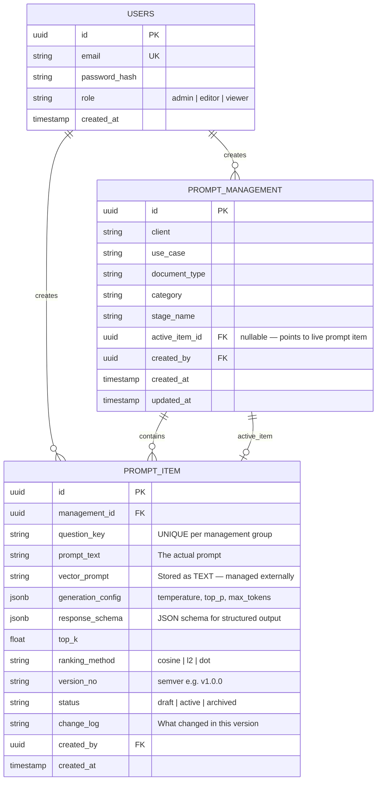
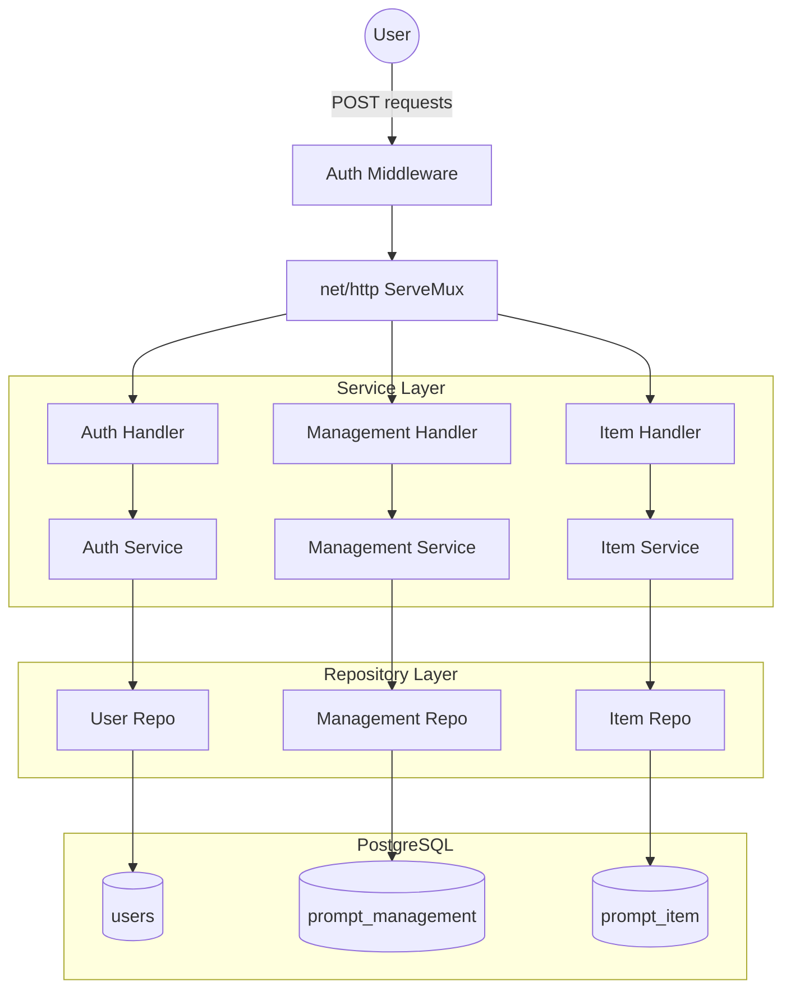

# Production-Grade Proposal: Go Prompt Management Service

## 1. Executive Summary

Build a production-ready, versioned **Prompt Management Service** in Go using native `net/http` and PostgreSQL. This service acts as a **centralized prompt configuration registry** — enabling teams to store, version, and manage prompts and their associated configs. Vector search queries and embeddings are managed **externally** by the consumer of this service; this service only stores and serves prompt data.

> [!NOTE]
> **Scope**: This service is a pure **CRUD prompt config store**. It does NOT call any LLM APIs or perform vector similarity searches internally. `vector_prompt` is stored and returned as a plain string for external use.

## ✅ Confirmed Technical Decisions

| Decision | Choice |
|----------|--------|
| **DB Driver** | `pgx` (`jackc/pgx/v5`) — direct PostgreSQL driver, no ORM |
| **Auth** | Simple JWT (HS256) — stateless, no refresh token rotation |
| **Deletes** | Soft delete — `deleted_at` timestamp, data remains recoverable |
| **Web Layer** | Native `net/http` (Go 1.22+ ServeMux) — no external framework |
| **API Style** | POST-only — action-based routing (`/prompts/list`, `/prompts/items/promote`) |

---

## 2. Critical Review of Your Design

### 2.1 Flow Analysis

Your proposed flow:
```
User Login → Add Prompt → Vector search → LLM → Save Prompt → All Prompts → Edit → Save → All Prompts
```

| # | Observation | Decision |
|---|-------------|----------|
| 1 | "Vector search" step in flow | Removed from service — managed externally by you |
| 2 | "LLM" step in flow | Removed — no LLM API calls in this service |
| 3 | No `Active/Draft/Archived` states | ✅ Added lifecycle status per prompt item |
| 4 | No audit trail of who changed what | ✅ Added `created_by` / `updated_by` fields |
| 5 | `prompt_old` is fragile — single snapshot | ✅ Replaced with immutable version rows |
| 6 | `vector_prompt` stored as `string` | ✅ Kept as `TEXT` — stored as-is, no internal processing |
| 7 | No `question_key` uniqueness per group | ✅ Added `UNIQUE(management_id, question_key)` constraint |

### 2.2 API Method Pattern
Per your requirement: **all operations use `POST` method only.**

---

## 3. Database Schema

### 3.1 Design Decisions
- `prompt_old` → **removed** (full history via immutable version rows)
- `vector_prompt` remains as **`TEXT`** — consumer manages search externally
- `active_item_id` on `PROMPT_MANAGEMENT` acts as the "production pointer"
- `ranking_method` moved to `PROMPT_ITEM` (item-scoped, not group-scoped)
- Added `Users` table for auth

### 3.2 ERD



---

## 4. Application Architecture



### 4.1 Prompt Lifecycle

```
1. POST /auth/login          → Get JWT

2. POST /prompts/create      → Create a Management group (client, use_case, etc.)

3. POST /prompts/items/add   → Add first prompt item
   └── Saves new PROMPT_ITEM row with status=draft

4. POST /prompts/items/list  → View all versions for a group

5. POST /prompts/items/promote → Set item as Active
   └── Sets PROMPT_MANAGEMENT.active_item_id = itemId
       Sets previous active to status=archived

6. POST /prompts/items/add   → Add edited version (new immutable row, status=draft)
   └── version_no auto-incremented (v1.0.0 → v1.0.1)

7. POST /prompts/list        → List all Management groups (filterable)
```

---

## 5. API Design (POST-only)

> [!IMPORTANT]
> All endpoints use `POST` method. Route names act as the "action" identifier.

### 5.1 Auth
| Endpoint | Description | Auth Required |
|----------|-------------|---------------|
| `POST /auth/register` | Register new user | ❌ |
| `POST /auth/login` | Login, returns JWT | ❌ |
| `POST /auth/refresh` | Refresh JWT | ✅ |

### 5.2 Prompt Management (Groups)
| Endpoint | Description | Body |
|----------|-------------|------|
| `POST /prompts/create` | Create a management group | `{client, use_case, document_type, category, stage_name}` |
| `POST /prompts/update` | Update group metadata | `{id, ...fields}` |
| `POST /prompts/get` | Get group + active item | `{id}` |
| `POST /prompts/list` | List all groups (paginated) | `{filters, page, per_page}` |
| `POST /prompts/delete` | Soft-delete a group | `{id}` |

### 5.3 Prompt Items (Versions)
| Endpoint | Description | Body |
|----------|-------------|------|
| `POST /prompts/items/add` | Add a new version | `{management_id, question_key, prompt_text, vector_prompt, generation_config, response_schema, top_k, ranking_method, change_log}` |
| `POST /prompts/items/list` | List all versions for a group | `{management_id, status?, page}` |
| `POST /prompts/items/get` | Get a specific item | `{id}` |
| `POST /prompts/items/promote` | Mark item as Active | `{management_id, item_id}` |
| `POST /prompts/items/archive` | Archive an item | `{id}` |

### 5.4 Standard JSON Response Envelope
```json
{
  "success": true,
  "data": { ... },
  "error": null,
  "meta": {
    "page": 1,
    "per_page": 20,
    "total": 150
  }
}
```

---

## 6. Go Project Structure

```text
prompt-management/
├── cmd/
│   └── api/
│       └── main.go                     # Entry point: wires everything, starts server
│
├── internal/
│   ├── config/
│   │   └── config.go                   # Env-based config (DB DSN, JWT secret, port)
│   │
│   ├── domain/                         # Pure domain types — no external imports
│   │   ├── user.go                     # User struct + role constants
│   │   ├── prompt.go                   # PromptManagement + PromptItem structs
│   │   └── errors.go                   # Domain error types (ErrNotFound, ErrConflict)
│   │
│   ├── repository/
│   │   ├── interfaces.go               # Repository interfaces (UserRepo, ManagementRepo, ItemRepo)
│   │   └── postgres/
│   │       ├── db.go                   # Connection pool setup (pgx / database/sql)
│   │       ├── user_repo.go
│   │       ├── management_repo.go
│   │       └── item_repo.go            # CRUD + version management queries
│   │
│   ├── service/
│   │   ├── auth_service.go             # JWT creation, validation, password hashing
│   │   ├── management_service.go       # Business rules for groups
│   │   └── item_service.go             # Versioning logic (semver bump, promote, archive)
│   │
│   └── handler/
│       ├── router.go                   # Registers all POST routes on http.ServeMux
│       ├── middleware/
│       │   ├── auth.go                 # JWT verification middleware
│       │   ├── logger.go               # Structured request logging (slog)
│       │   └── recovery.go             # Panic recovery
│       ├── auth_handler.go
│       ├── management_handler.go
│       └── item_handler.go
│
├── pkg/
│   ├── jwt/
│   │   └── jwt.go                      # Token sign/parse utilities
│   ├── validator/
│   │   └── validator.go                # JSON payload validation helpers
│   ├── password/
│   │   └── password.go                 # bcrypt hash/compare
│   └── response/
│       └── response.go                 # Standard JSON response writer helpers
│
├── migrations/
│   ├── 001_create_users.sql
│   ├── 002_create_prompt_management.sql
│   └── 003_create_prompt_item.sql
│
├── docker-compose.yml                  # PostgreSQL setup
├── Makefile                            # migrate, run, test, lint commands
├── .env.example
└── README.md
```

---

## 7. Key Technical Decisions

### 7.1 Middleware Chain
```go
mux := http.NewServeMux()
handler := middleware.Logger(
    middleware.Recovery(
        middleware.Auth(mux, jwtClient),
    ),
)
http.ListenAndServe(":8080", handler)
```

### 7.2 Auto Version Numbering
```go
// Immutable rows — each edit creates a new row
// version_no auto-incremented on insert
func NextPatchVersion(current string) string {
    // "v1.0.0" → "v1.0.1"
    // major/minor bumps can be user-flagged in the request
}
```

### 7.3 Error Handling Pattern
```go
var (
    ErrNotFound   = errors.New("resource not found")       // → 404
    ErrConflict   = errors.New("resource already exists")  // → 409
    ErrForbidden  = errors.New("insufficient permissions") // → 403
    ErrValidation = errors.New("invalid input")            // → 400
)
```

### 7.4 Promote Flow (DB Transaction)
```sql
BEGIN;
  -- 1. Archive current active
  UPDATE prompt_item SET status = 'archived'
  WHERE id = (SELECT active_item_id FROM prompt_management WHERE id = $1);

  -- 2. Set new active
  UPDATE prompt_item SET status = 'active' WHERE id = $2;

  -- 3. Update pointer
  UPDATE prompt_management SET active_item_id = $2, updated_at = now() WHERE id = $1;
COMMIT;
```

---

## 8. Production Considerations

| Concern | Approach |
|---------|----------|
| **Observability** | Structured logging via `slog`, `GET /metrics` Prometheus endpoint |
| **Health Checks** | `GET /healthz` (liveness), `GET /readyz` (DB ping check) |
| **DB Connections** | `pgxpool` with configurable `max_conns`, `min_conns` |
| **Rate Limiting** | Token-bucket middleware per user |
| **Graceful Shutdown** | `context`-based drain with configurable timeout |
| **Config Management** | `os.Getenv` with `.env` loader for local dev |
| **Unit Testing** | Mock repositories via interfaces + `testify` |
| **Integration Tests** | `testcontainers-go` with real Postgres container |
| **Migrations** | `golang-migrate` CLI — versioned SQL files |

---

## 9. Docker Compose

```yaml
services:
  postgres:
    image: postgres:16-alpine
    environment:
      POSTGRES_DB: prompt_management
      POSTGRES_USER: postgres
      POSTGRES_PASSWORD: postgres
    ports:
      - "5432:5432"
    volumes:
      - pgdata:/var/lib/postgresql/data

volumes:
  pgdata:
```

---

## 10. Soft Delete Strategy

All tables include a `deleted_at TIMESTAMPTZ` column. Queries always filter with `WHERE deleted_at IS NULL`.

```sql
-- Soft delete a management group
UPDATE prompt_management
SET deleted_at = NOW()
WHERE id = $1 AND deleted_at IS NULL;

-- All list queries filter soft-deleted rows
SELECT * FROM prompt_management
WHERE client = $1 AND deleted_at IS NULL
ORDER BY updated_at DESC
LIMIT $2 OFFSET $3;
```

## 11. pgx Usage Pattern

```go
// Using pgx/v5 directly — no ORM overhead
pool, err := pgxpool.New(ctx, os.Getenv("DATABASE_URL"))

// Named struct scanning
rows, _ := pool.Query(ctx, "SELECT id, prompt_text FROM prompt_item WHERE management_id = $1", id)
items, _ := pgx.CollectRows(rows, pgx.RowToStructByName[domain.PromptItem])
```
